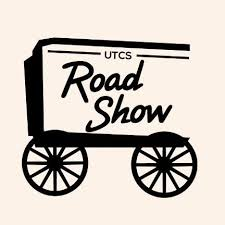
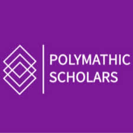
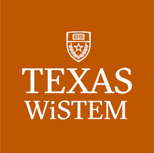

<!-- About Me -->
<section>
  <h3>About Me</h3>
  
CS + Math + Stats Triple Major Honors @ UT Austin

  
Software Engineer

</section>

<!-- Technical Skills -->
<section>
  <h3>Technical Skills</h3>
  
Java, C, R, Python, OpenCV.

</section>

<!-- Education -->
<section>
  <h3>Education</h3>

  

    
<strong>Bachelor of Science and Arts, Honors, Computer Science</strong> (Aug 2025 - Present)

    
<strong>Bachelor of Science and Arts, Honors, Mathematics</strong> (Aug 2023 - Present)

    
<strong>Bachelor of Science, Statistics and Data Science</strong> (Aug 2023 - Present)

  

</section>

<!-- Experiences -->
<section>
  <h3>Experiences</h3>

  <!-- Jane Street -->
  

    <h4>Jane Street Insight Program Software Engineering Track Participant</h4>
    
<em>Aug 2025 – Aug 2025 | NYC, New York</em>

    <ul>
      <li>Selected as 1 of 24 participants worldwide.</li>
      <li>Learned how to use functional programming language OCaml to implement the Snake game.</li>
    </ul>

    

      
      
    

  

   

  <!-- Geometry of Space -->
  

    <h4>Software Developer &amp; Machine Learning Researcher: Geometry of Space</h4>
    
<em>Jan 2025 – Dec 2025 | Austin, Texas</em>

    <ul>
      <li>
        Designed and trained supervised learning models to classify cluster types based on spatial and photometric features, improving classification accuracy by 18%.
      </li>
      <li>
        Developed a deep learning–based rotational alignment technique for preprocessing radio galaxy classification, improving efficiency by 40%.
      </li>
      <li>
        Automated stellar data analysis pipeline and computed mass-to-light ratios across 200+ radio galaxies.
      </li>
    </ul>

    

      
    

  

   

  <!-- Computer Vision Lab -->
  

    <h4>Computer Vision Researcher: Computer Vision Lab</h4>
    
<em>Mar 2025 – Oct 2025 | Austin, Texas</em>

    <ul>
      <li>
        Developed an OpenCV prototype for real-time gesture recognition using OpenCV algorithms for 2D &amp; 3D feature extraction on guitar videos.
      </li>
      <li>
        Engineered chord and fret detection system, increasing edge detection accuracy by 30% over baseline methods.
      </li>
    </ul>
  

</section>

<!-- Leadership -->
<section>
  <h3>Leadership</h3>

  <!-- Roadshow -->
  <table>
    <tr>
      <td>
        
      </td>

      <td>
        <h4>Operations Officer: UTCS Roadshow Outreach</h4>
        
<em>Apr 2025 - Present</em>

        <ul>
          <li>
            Organizing outreach logistics by creating sign-up systems, making monthly meeting PowerPoints, and scheduling volunteers.
          </li>

          <li>
            Inspired and mentored Austin-area middle and high school students to explore computer science through Finch robot design.
          </li>
        </ul>
      </td>
    </tr>
  </table>

   

  <!-- Polymathic Scholars -->
  <table>
    <tr>
      <td>
        
      </td>

      <td>
        <h4>Peer Mentor: Polymathic Scholars Honors Program</h4>
        
<em>Aug 2025 - May 2026</em>

        <ul>
          <li>
            Met monthly with freshmen in the honors program and provided guidance on academic course planning and general life advice.
          </li>
        </ul>
      </td>
    </tr>
  </table>

   

  <!-- Women in STEM -->
  <table>
    <tr>
      <td>
        
      </td>

      <td>
        <h4>STEM Role Model &amp; Outreach Ambassador: UT Women in STEM</h4>
        
<em>Mar 2025 - Oct 2025</em>

        <ul>
          <li>
            Offered constructive feedback to participants in STEM summer camp Engineering Design Challenges.
          </li>

          <li>
            Served as a STEM role model by leading small-group discussions and providing career guidance to 100+ summer campers.
          </li>
        </ul>
      </td>
    </tr>
  </table>
</section>

