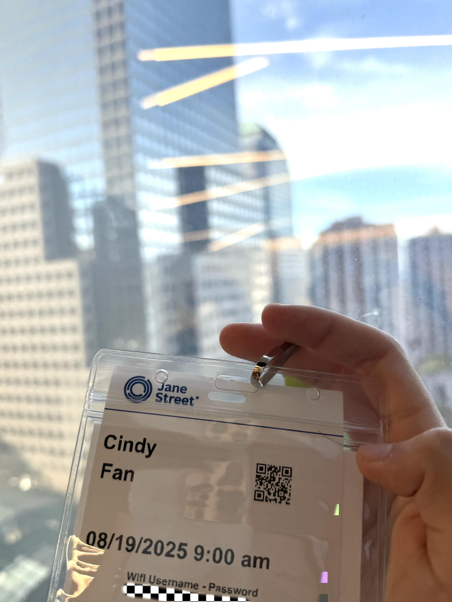
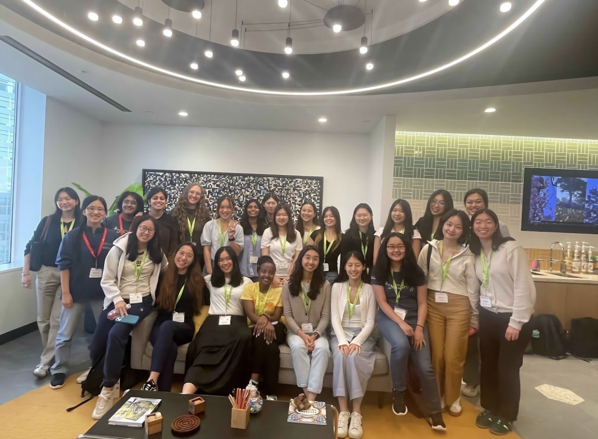
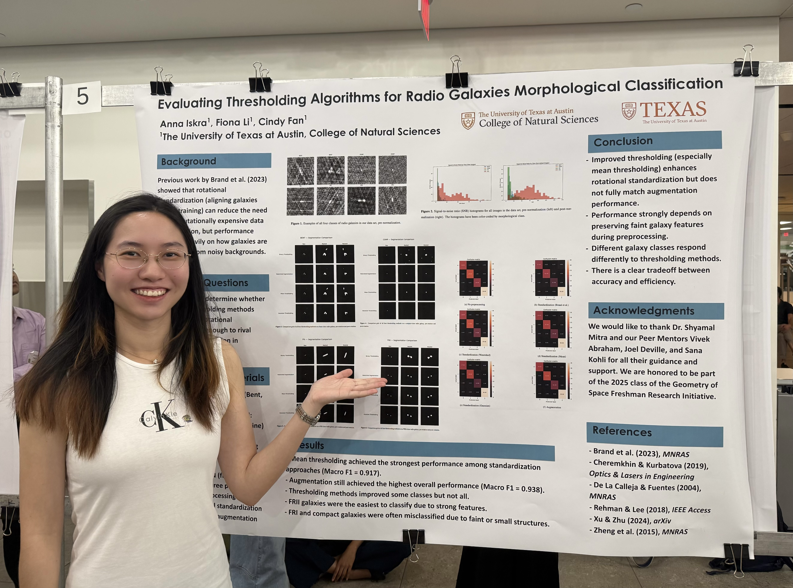

### About Me:
CS + Math + Stats Triple Major Honors @ UT Austin  
Software Engineer  

### Technical Skills: 
Java, C, R, Python, OpenCV.

### Education:
Bachelor of Science and Arts, Honors, Computer Science (Aug 2025 - Present)  
Bachelor of Science and Arts, Honors, Mathematics (Aug 2023 - Present)  
Bachelor of Science, Statistics and Data Science (Aug 2023 - Present)

### Experiences:
Jane Street Insight Program Software Engineering Track Participant (Aug 2025 – Aug 2025)  NYC, New York  
- Selected as 1 of 24 participants worldwide.  
- Learned how to use functional programming language OCaml to implement the Snake game.

  
  

Software Developer & Machine Learning Researcher: Geometry of Space (Jan 2025 – Dec 2025)  Austin, Texas  
- Designed and trained supervised learning models to classify cluster types based on spatial and photometric features, improving classifi-
cation accuracy by 18%.  
- Developed a deep learning–based rotational alignment technique for preprocessing radio galaxy classification, improving efficiency by
40%.  
- Automated stellar data analysis pipeline and computed mass-to-light ratios across 200+ radio galaxies.

Computer Vision Researcher: Computer Vision Lab (Mar 2025 – Oct 2025)  Austin, Texas
- Developed an OpenCV prototype for real-time gesture recognition using OpenCV algorithms for 2D & 3D feature extraction on guitar videos.  
- Engineered chord and fret detection system, increasing edge detection accuracy by 30% over baseline methods.

### Leaderships:  
Operations Officer: UTCS Roadshow Outreach (Apr 2025 - Present)  
- Organizing outreach logistics by creating sign-up systems, making monthly meetings powerpoints, and scheduling volunteers.  
- Inspired and mentored Austin-area middle and high school students to explore computer science through Finch robot design.  

Peer Mentor: Polymathic Scholars Honors Program (Aug 2025 - May 2026)   
- Met monthly with freshmen in the honors program and provided guidance on academic course planning and general life advice.  

STEM Role Model & Outreach Ambassador: UT Women in STEM (Mar 2025 - Oct 2025)   
- Offered constructive feedback to participants in STEM summer camp Engineering Design Challenges.
- Served as a STEM role model by leading small-group discussions and providing career guidance to 100+ summer campers.

